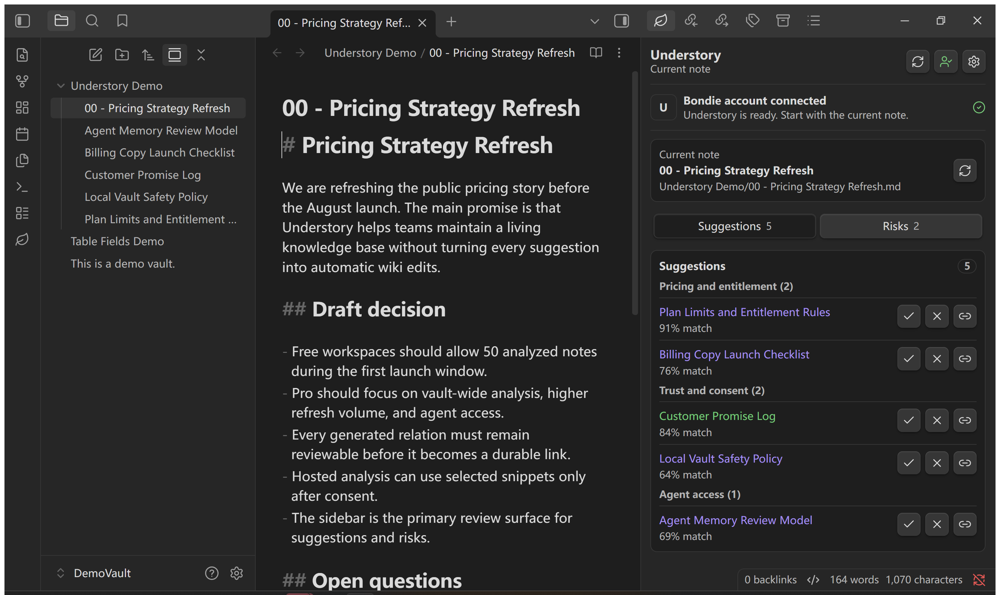
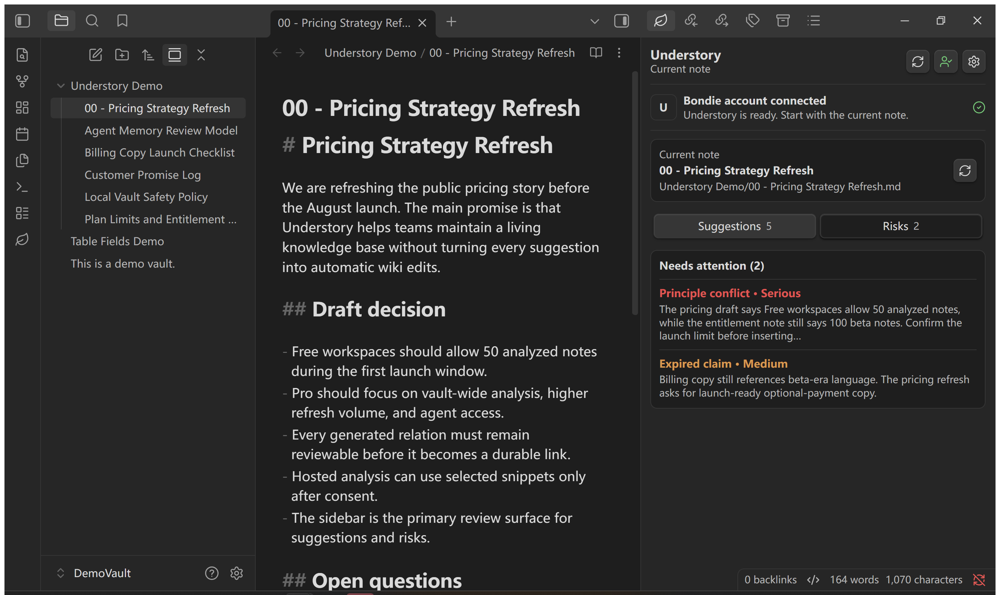

# Understory
> 机器负责发现可能相关的笔记，人负责把可信关系变成 Obsidian 里的长期知识。

[English](README.md) · **中文** — [工程文档 ›](ENGINEERING.zh-CN.md)

  

Understory 是 Obsidian 里的知识维护循环。它会发现可能的关系，提醒旧建议何时需要更新，并在冲突扩散成难整理的问题前把它们放到你面前。

核心规则很简单：**机器发现只是建议；人的发现、人工确认和已维护的结构拥有更高权威**。Understory 可以建议、刷新、提醒风险，但真正成为长期记忆的是你采纳的链接、忽略的噪音、手写的 wiki 链接，以及你维护过的实体关系。

默认体验从 **Continue with Bondie** 开始。登录一次即可使用托管 Understory 服务，不需要选择模型 provider、粘贴 API key、安装 Python 或配置 endpoint。

## 让机器发现候选关系

打开一篇 Markdown 笔记，点击 **生成建议**。Understory 会围绕当前笔记缩小 vault 候选范围，并把结果放进右侧栏审阅队列。

- 它会从你正在阅读的笔记出发，再考虑允许参与的文件夹、已有链接、反向链接、标题重合、内容重合和最近编辑。
- 托管模式只会在你同意后发送有限长度的笔记片段；高级本地模式可以使用内置 graph engine。
- 新结果进入系统时只是建议，不是真理。
- 右侧栏仍然是审阅点；刷新建议不会悄悄改写正文。

## 让人的判断高于后续机器刷新

每条关系都有人工决策状态。你可以打开、采纳、忽略，或把它插入为普通 Obsidian 链接。

- **采纳** 会把关系标记为已审阅、可信。
- **忽略** 会为这条关系记录删除记忆，避免同一个机器建议在下一次扫描后立刻复活。
- **插入** 会写入普通 wiki 链接，并把关系标记为采纳。
- 生成区块之外的手写链接会被保留，这是设计原则。
- 如果你之后手动把链接加回来，这个新的人工动作会清除之前的删除记忆。

这是 Understory 最重要的产品行为：机器可以发现关系，但由你决定它是否成为 vault 的一部分。

## 在笔记变化后更新关系

关联发现不是一次性导入。Understory 会保存每篇已分析笔记的快照，并能判断当前建议是不是基于旧内容生成的。

- 编辑后的笔记可以在安静窗口后安排后台关系更新。
- 手动 **Update suggestions** 会立即更新当前笔记。
- 每周或每月刷新可以按选定范围逐篇处理 vault。
- include/exclude 文件夹可以把草稿、归档、私密文件夹和生成文件排除在更新循环之外。
- 如果目标笔记移动或消失，Understory 会标记关系异常，而不是静默修改缓存。

## 在相关笔记旁边发现冲突

**Risks** 页是审阅循环的另一半。它服务的是 vault 维护：那些只有扩散到许多笔记后才会变难处理的问题。

- **潜在冲突**：两篇笔记可能在表达不兼容的主张。
- **过期建议**：已保存关系早于当前笔记内容。
- **断裂链接**：链接已经不能解析到笔记。
- **孤立笔记**：没有有效外链，也没有反向链接。
- **提取出的原则或主张**：在更大范围 vault 分析中供你审阅。

结果是一条维护队列，而不是通知轰炸。Understory 会保留严重项目，按严重程度排序，并让你刷新、打开或修改对应笔记。

## 把人工维护的结构当成更强证据

当 vault 里有已维护的实体关系时，Understory 也可以使用这层结构。它能找到纯文本相似度可能漏掉的关系。

- 用户定义、frontmatter、导入和 API 创建的关系会被当成权威结构。
- LLM 抽取、名称识别和相似度推断只是候选发现渠道，等待审阅。
- 本地引擎可以沿着实体关系做一跳扩展，再和语义、关键词证据合并。
- 当已维护结构变化时，受影响的关系发现可以重新刷新，而不是永远相信旧建议。

机器发现帮助 Understory 注意到可能性；人工维护的结构告诉它哪些关系可以作为更强证据。

## 让 Agent 遵守同一套审阅规则

当你希望 Claude、ChatGPT、Codex 或其他助手查询当前 vault 时，打开 **设置 -> Understory -> AI agents**。

- 导出当前 vault 专用的 MCP server 文件。
- 复制可直接使用的 MCP 配置。
- 选择 **Query-only**，只允许搜索和上下文检索，不写入。
- 选择 **Agent memory model**，让 Agent 在工作后提出长期记忆更新。
- 工具只有通过明确写入动作，才能采纳、拒绝、刷新或插入关系。

Agent 读取默认返回有限片段、note brief、关系元数据、图谱摘要和诊断。它看到的 stale 标记和关系状态，与右侧栏一致。

## 信任、隐私和账号模式

托管模式以账号为入口。**Continue with Bondie** 会打开浏览器登录，并回到同一个 vault。托管模型工作使用 **server-managed provider** 凭据；provider key 不会返回到插件。

- 托管关系发现或 vault 分析发送片段前，需要你同意 selected-snippet consent。
- 托管收集会排除隐藏文件夹、Obsidian 配置、回收站路径和 Understory 工作文件。
- 会话状态、设置、关系缓存、忽略记录和报告会保存在本地 vault 或插件数据中。
- 升级前已使用本地模式的用户，升级后仍保持本地模式。
- 自托管和 BYOK 工作流仍然在 **Advanced** 中。

Understory 可以免费安装，当前托管会员也是 Free。Obsidian Community listing 应显示 **Optional payments**，因为 Understory 连接托管服务，并且高级模式可以连接付费 API。

## 从任意 Markdown 笔记开始

1. 在 Obsidian 桌面端安装并启用 Understory。
2. 点击叶片图标，选择 **Continue with Bondie**，完成登录。
3. 打开一篇 Markdown 笔记，点击 **生成建议**。
4. 审阅 **Suggestions** 和 **Risks**。
5. 只采纳、忽略、打开或插入你信任的关系。

当前版本：`1.13.8`。Understory 目标版本为 Obsidian `1.8.7` 或更新版本，仅支持桌面端。

## 你需要知道

- Understory 不是全自动 wiki 写手；默认工作流会把生成关系留在右侧栏，直到你行动。
- 被忽略的建议可能在删除记忆过期后重新出现，或在目标内容变化到值得重看时重新出现。
- 本地引擎工作流属于高级能力，可能需要 Python 运行时健康检查。
- 完整数据流见 **[PRIVACY.md](PRIVACY.md)**，安全问题报告见 **[SECURITY.md](SECURITY.md)**，实现路径见 **[工程文档 ›](ENGINEERING.zh-CN.md)**。
